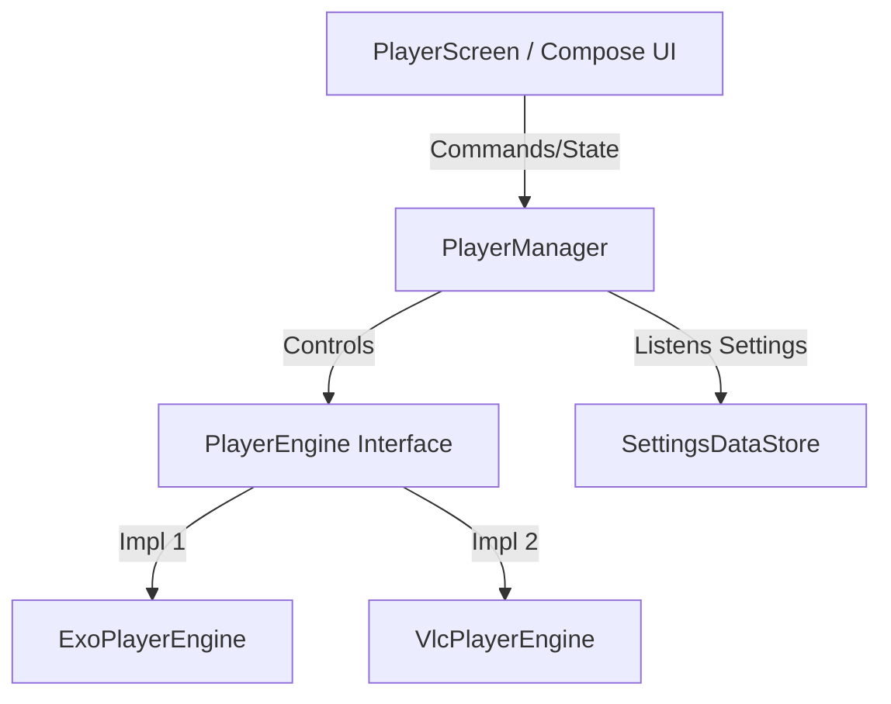

<div align="center">
  
  <h1>🎬 iMAX Player</h1>
  <p><b>Premium Media Player for Android TV & Mobile</b></p>
  <p><i>A production-grade IPTV client featuring a dual-navigation Compose UI, high-performance hybrid playback pipelines, encrypted parental controls, and smart title metadata enrichment.</i></p>

[](https://kotlinlang.org)
[](https://developer.android.com/jetpack/compose)
[](https://android-arsenal.com/api?level=26)
[](https://opensource.org/licenses/MIT)
</div>

---

## ✨ Features

### 📺 Dual-Platform Unified Interface
* **Android Mobile**: Touch-optimized gestures, responsive layouts, portrait/landscape orientation management, and Picture-in-Picture (PiP) support.
* **Android TV**: 10-foot user experience (10ft UI), full D-pad remote navigation, visible focus indicators, stable item scaling, and persistent focus memory.

### 🎬 Advanced Content Hub
* **Multi-Format Playlists**: Supports M3U/M3U8 URLs, Xtream Codes credentials, and local file imports.
* **Live TV**: Category-based channels browsing, favorite channels list, and interactive Electronic Program Guide (EPG).
* **Movies & VOD**: Category grid navigation, high-quality posters, rating tags, cast listings, and storyline summaries.
* **TV Series**: Structured season-by-season and episode-by-episode browsing with continuation support.
* **Continue Watching**: Persistent playback progress bars to quickly resume movies and episodes.

### 🎮 Adaptive Hybrid Player Engine
* **Double Playback Engine**: Uses Media3 / ExoPlayer as the primary high-performance engine, with a native LibVLC fallback engine to handle legacy IPTV formats or codec edge cases.
* **Seamless Settings Control**: Switch the active player engine at runtime instantly from Settings without restarting the application.
* **Advanced Player Customization**: Audio track selection, subtitle track toggling, aspect ratio scaling (Fit, Fill, Zoom, 16:9, 4:3), and playback speed control (0.5x to 2x).

### 🎨 Premium Aesthetics
* **Neo-Dark Theme**: Sleek UI palette utilizing modern neon red and blue gradients.
* **Glassmorphic Elements**: Elegant semi-transparent cards and overlays on hero banners.
* **Micro-Animations**: Custom shimmer loading effects, focus borders, and glow halo highlights designed for TV D-pad actions.

---

## 🏗️ Architecture & Module Layering

iMAX Player is built as a single-module Gradle project (`:app`) implementing **Clean Architecture** combined with **MVVM (Model-View-ViewModel)**. The codebase separates concerns into isolated layers, maintaining a strict dependency boundary.

```
com.imax.player/
├── core/                         # Domain models, database layer, shared services
│   ├── common/                   # Constants, Coil setups, Search & Category helpers
│   ├── database/                 # Room entities, DAOs, mappers, and migrations
│   ├── datastore/                # DataStore Preferences for settings configuration
│   ├── designsystem/             # App theme (colors, typography, shape tokens)
│   ├── model/                    # Plain domain model representations
│   ├── network/                  # DTOs, Retrofit APIs (Xtream & TMDB clients)
│   ├── player/                   # Playback engine interfaces, ExoPlayer and VLC modules
│   ├── security/                 # parental control locks and hashing operations
│   ├── service/                  # PlaybackService for media session integrations
│   └── worker/                   # Background WorkManager tasks and sync orchestration
├── data/                         # Parser implementations and repository orchestration
│   ├── parser/                   # SAX-based XMLTV parser, M3U and Xtream clients
│   └── repository/               # Content repositories coordinating cache and network APIs
├── di/                           # App-level dependency injection (Hilt modules)
├── metadata/                     # Title enrichment and TMDB metadata management
└── ui/                           # UI elements and ViewModels (separated by feature)
    ├── components/               # Shared Composables (TV focus effects, sliders, tabs)
    ├── navigation/               # NavHostGraphs (separate graphs for TV vs Mobile)
    └── screens/                  # Home, Onboarding, Live, Movies, Series, Settings...
```

### Clean Architecture Rules
1. **Separation of Logic**: ViewModels manage UI state using StateFlow. Composables remain purely presentation-oriented and do not access DAOs, parsers, or network clients directly.
2. **Hilt Dependency Injection**: Constructor injection is preferred everywhere. Provider modules are reserved for configuring third-party libraries (Room, Retrofit, OkHttp).
3. **Threading Isolation**: Database insertions, playlist downloads, and file parsing are explicitly directed to background threads (using Coroutines `Dispatchers.IO`).

---

## ⚙️ Technical Implementation Deep-Dives

### 📺 Dynamic Device Mode Detection
On startup, [DeviceUtils](file:///home/meliheeren/iMAX%20Player/app/src/main/java/com/imax/player/core/common/DeviceUtils.kt) resolves the device configuration. The app queries `UiModeManager` for television mode and checks the package manager for `FEATURE_LEANBACK` or `FEATURE_TELEVISION`.
Based on this resolution, [ImaxNavHost](file:///home/meliheeren/iMAX%20Player/app/src/main/java/com/imax/player/ui/navigation/Navigation.kt) dynamically loads either the touch-gestures [MobileNavGraph](file:///home/meliheeren/iMAX%20Player/app/src/main/java/com/imax/player/ui/navigation/mobile/MobileNavGraph.kt) or the remote-optimized [TvNavGraph](file:///home/meliheeren/iMAX%20Player/app/src/main/java/com/imax/player/ui/navigation/tv/TvNavGraph.kt).

### 🎮 The Dynamic Player Engine Pipeline
Both playback engines are isolated behind the [PlayerEngine](file:///home/meliheeren/iMAX%20Player/app/src/main/java/com/imax/player/core/player/PlayerEngine.kt) interface:
* **ExoPlayerEngine**: Leverages Google's modern Media3 player, supplying custom hardware decoding flags via `ImaxRenderersFactory`.
* **VlcPlayerEngine**: Integrates LibVLC natively to playback streams containing legacy audio/video codecs that fail on standard Media3.

The lifecycle, runtime switching, settings application, and playback commands are handled centrally by the [PlayerManager](file:///home/meliheeren/iMAX%20Player/app/src/main/java/com/imax/player/core/player/PlayerManager.kt). The engine can switch mid-stream while maintaining the current VOD playback position.



### 🔁 Exponential Backoff & Connectivity Retry
Network drops are managed by the [StreamRetryManager](file:///home/meliheeren/iMAX%20Player/app/src/main/java/com/imax/player/core/player/StreamRetryManager.kt). When a playback error occurs:
1. The error message is classified to isolate device connection drop (`NO_INTERNET`) from stream dead states (`STREAM_OFFLINE`).
2. An exponential backoff cycle initiates, scheduling retries at **2s**, **4s**, and **8s** delays, displaying a countdown on the player overlay.
3. If no internet is detected, it registers a `ConnectivityManager.NetworkCallback` to suspend until connection validation is restored before retrying the player connection.

### ⏰ Sleep Timer
The [SleepTimerManager](file:///home/meliheeren/iMAX%20Player/app/src/main/java/com/imax/player/core/player/SleepTimerManager.kt) offers duration options (15, 30, 45, 60, 90 mins). During the final minute, the manager toggles the `isLastMinute` flag, allowing the UI to trigger a soft audio/video fade-out warning before playback termination.

### 🛡️ Secure Parental Control Lockouts
The [ParentalControlManager](file:///home/meliheeren/iMAX%20Player/app/src/main/java/com/imax/player/core/security/ParentalControlManager.kt) restricts child-safety access:
* **Storage Encryption**: The 4-digit PIN hash is stored in `EncryptedSharedPreferences` backed by the hardware-backed **Android KeyStore**.
* **PBKDF2 Hashing**: PIN verification uses salted PBKDF2 hashing via [PinHasher](file:///home/meliheeren/iMAX%20Player/app/src/main/java/com/imax/player/core/security/PinHasher.kt) to prevent unauthorized decryption.
* **Brute-Force Lockout**: 5 failed PIN attempts results in a **30-second lockout** where the verification API is temporarily suspended.
* **Category Whitelists**: Restrict categories on a fine-grained level. Content from non-whitelisted categories is hidden from menus during Child Lock active state.

### 📡 Automated WorkManager Scheduling
Background updates are scheduled to conserve battery and data footprint:
* **EPG Syncing**: [EpgSyncWorker](file:///home/meliheeren/iMAX%20Player/app/src/main/java/com/imax/player/core/worker/EpgSyncWorker.kt) runs daily to download XMLTV feeds, purge expired programs, and batch insert fresh schedules in chunks of 500 to prevent database transaction timeouts.
* **Playlist Refresher**: [PlaylistRefreshWorker](file:///home/meliheeren/iMAX%20Player/app/src/main/java/com/imax/player/core/worker/PlaylistRefreshWorker.kt) updates M3U lists silently at user-specified intervals (6h, 12h, 24h).
* **Post-Sync Stream Health Verification**: [StreamHealthCheckWorker](file:///home/meliheeren/iMAX%20Player/app/src/main/java/com/imax/player/core/worker/StreamHealthCheckWorker.kt) queries channel stream links using lightweight HTTP HEAD requests. Channels are processed in batches of 10 with 200ms inter-batch delays to prevent provider rate limiting. Offline streams are flagged in the DB (`isOnline = false`).

### 🔍 Smart Search Matching & Cleaning
The title search engine optimizes query accuracy by bypassing standard substring containment limitations:
* **Query Normalization**: [SearchMatcher](file:///home/meliheeren/iMAX%20Player/app/src/main/java/com/imax/player/core/common/SearchMatcher.kt) strips special characters and transliterates regional alphabets (e.g. Turkish `İ/ı` to `I/i` via [StringUtils](file:///home/meliheeren/iMAX%20Player/app/src/main/java/com/imax/player/core/common/StringUtils.kt)).
* **Acronym & Coverage Matching**: Search supports token matching, acronym matching (matching `GOT` to `Game of Thrones`), and strips noise terms such as `4K`, `FHD`, `UHD`, `Dublaj`, or `Altyazı`.
* **Fuzzy Scoring**: Utilizes the **Jaro-Winkler similarity** metric to score and rank matches above custom-scaled thresholds.

### 🎬 Local TMDB Metadata Lookup & Cache
The app enriches playlist title metadata by looking up information from The Movie Database (TMDB) dynamically:
* **Fuzzy Title Clean**: [MetadataProvider](file:///home/meliheeren/iMAX%20Player/app/src/main/java/com/imax/player/metadata/MetadataProvider.kt) strips codec, year, and translation markers to formulate clean queries.
* **Jaro-Winkler Verification**: Calculates similarity scores between the playlist item and TMDB search candidates, rejecting results below 35% similarity (or 50% for titles ≤ 3 characters) to eliminate incorrect matching.
* **Fallback Translation Pipeline**: Searches are performed prioritizing (1) Turkish locale, (2) Content original language, and (3) English fallback, preventing blank description layouts.
* **Database Caching**: Resolved records are cached with a **7-day Time-to-Live (TTL)** in Room to reduce API requests.

### 🛡️ Credential-Safe Redacted Logging
To safeguard user privacy, [SensitiveLog](file:///home/meliheeren/iMAX%20Player/app/src/main/java/com/imax/player/core/common/SensitiveLog.kt) automatically sanitizes URLs:
It parses URLs into structured URIs, stripping sensitive Xtream Codes parameters, path folders, username details, and passwords, replacing them with a safe `[redacted]` indicator before publishing details to the system logger.

### ⏪ Timeshift / IPTV Catch-up Resolver
[CatchupUrlResolver](file:///home/meliheeren/iMAX%20Player/app/src/main/java/com/imax/player/core/catchup/CatchupUrlResolver.kt) resolves URL formatting for catchup streams:
* Automatically detects Xtream standard timeshift URL rules (`/timeshift/{username}/{password}/{duration}/{start}/{stream_id}.ts`).
* Interpolates custom template channels containing placeholders like `{utc}`, `{utcend}`, `{duration}`, and `{start}` (formatted in `yyyy-MM-dd:HH-mm` UTC).

---

## 🛠️ Tech Stack & Versioning

| Component | Library / Framework | Version |
| :--- | :--- | :--- |
| **Language** | Kotlin | `2.0.21` |
| **UI Framework** | Jetpack Compose (BOM) | `2024.02.00` |
| **TV Extensions** | Compose for TV / TV Material | `1.0.0-alpha10` |
| **Navigation** | Navigation Compose | `2.7.7` |
| **DI Engine** | Hilt Android | `2.51` |
| **Local Database**| Room Database | `2.6.1` |
| **Preferences** | Preference DataStore | `1.0.9` |
| **Network Client**| Retrofit + OkHttp | `2.9.0` / `4.12.0` |
| **Serialization** | Kotlinx Serialization | `1.6.3` |
| **Image Loading** | Coil Compose | `2.6.0` |
| **Video Engine** | Media3 ExoPlayer | `1.3.0` |
| **VOD Fallback** | LibVLC Android SDK | `3.6.0-eap17` |
| **Concurrency** | Coroutines / Flows | `1.8.0` |
| **Diagnostic** | Timber | `5.0.1` |

---

## 🚀 Installation & Setup

### Prerequisites
* **Android Studio Ladybug** (2024.1.3+) or newer.
* **JDK 17** configured in your compilation path.
* **Android SDK 35** (compileSdk/targetSdk).
* Minimum target SDK: **API Level 26** (Android 8.0+).

### Building & Running

1. **Clone the Repository**
   ```bash
   git clone https://github.com/meliherenn/iMAX-Player.git
   cd iMAX-Player
   ```

2. **Configure your API Keys & Directories**
   Create a `local.properties` file in the root directory (or modify the existing one):
   ```properties
   sdk.dir=/path/to/your/Android/Sdk

   # Optional TMDB Key to enable posters, trailers, and overview summaries
   TMDB_API_KEY=your_tmdb_api_key_here
   ```

3. **Install Debug APK**
   ```bash
   # Build and install on connected device (Mobile or Android TV)
   ./gradlew installDebug
   ```

4. **Running Tests**
   ```bash
   # Run all local JVM Unit Tests
   ./gradlew testDebugUnitTest
   ```

---

## 📱 User Interaction & Controls

The player maps touch gestures on mobile devices and standard D-pad keys on Android TV remotes for responsive media navigation.

### TV Remote D-pad Mapping
| Remote Key | Player View Action | Settings / Browsing Menu |
| :--- | :--- | :--- |
| **Center / OK** | Toggle Play or Pause | Select highlighted card / settings option |
| **Left / Right** | Seek backward / forward | Scroll categories or channel lists |
| **Up / Down** | Open playback control overlays | Scroll vertically through channel grids |
| **Back** | Exit player / close overlay | Go back to previous menu |
| **Media Play/Pause** | Toggle playback | - |
| **Media FF / RW** | Trigger fast seeking | - |

### Mobile Touch Gestures
* **Single Tap**: Display controls, quality selection overlays, and audio track buttons.
* **Double Tap (Left / Right)**: Fast seek backward / forward by 10 seconds.
* **Vertical Slide (Left Screen)**: Adjust player screen brightness.
* **Vertical Slide (Right Screen)**: Adjust player sound volume.

---

## 🛡️ Legal Notice & Disclaimer

> [!WARNING]
> **iMAX Player DOES NOT PROVIDE, host, or pre-bundle any digital media content.** 
> The application serves strictly as an IPTV client tool to parse and display media streams from files, M3U playlists, XMLTV feeds, or Xtream Codes servers configured by the user.

* **User Content Ownership**: Users are solely responsible for obtaining authorization, subscriptions, and rights to play any media stream or playlist URLs added to this player.
* **Zero Affiliation**: iMAX Player has no associations with IPTV streaming providers, channel operators, or media list suppliers.
* **Liability Boundaries**: The developers of iMAX Player do not condone, facilitate, or promote unauthorized streaming of copyrighted digital content. Any actions contrary to digital rights laws are the sole responsibility of the user.

---

## 🤝 Contributing

We welcome community contributions! Please review the guidelines below to submit improvements:

1. **Fork the Repository** on GitHub.
2. **Create a Feature Branch** (`git checkout -b feature/AmazingFeature`).
3. **Commit your modifications** following local repository styling rules (`git commit -m 'Add some AmazingFeature'`).
4. **Push to your fork** (`git push origin feature/AmazingFeature`).
5. **Open a Pull Request** describing your additions, verifying that all tests pass (`./gradlew testDebugUnitTest`).

---

## 📄 License

This project is licensed under the **MIT License**. For details, review the [LICENSE](LICENSE) file.
